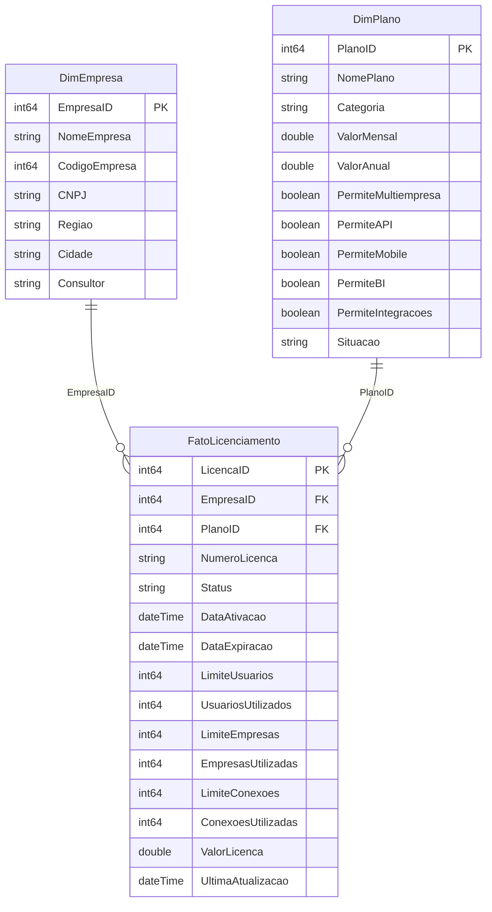

# Módulo de Licenciamento

Documentação técnica do módulo que acompanha o status das licenças SaaS dos
clientes (postos) em tempo real, do backend ao dashboard Power BI.

## 1. Diagrama do modelo de dados (Star Schema)

Duas dimensões (`DimEmpresa`, `DimPlano`) ligadas a uma tabela fato
(`FatoLicenciamento`) por relacionamentos 1:N, direção única (dimensão →
fato). Uma tabela `Medidas`, sem colunas de dados, concentra todo o DAX.

## 2. Tabelas criadas ou reutilizadas

| Camada | Tabela | Status | Onde vive |
|---|---|---|---|
| Postgres (OLTP) | `starvl_clients` | **Reutilizada**, 3 colunas novas (`sc_regiao`, `sc_cidade`, `sc_consultor`) | `starvl-api/routes/clients.js` |
| Postgres (OLTP) | `starvl_plans` | **Nova** | `starvl-api/routes/plans.js` |
| Postgres (OLTP) | `starvl_licenses` | **Nova** | `starvl-api/routes/licenses.js` |
| Power BI (semântico) | `DimEmpresa` | Nova, espelha `starvl_clients` | `powerbi/.../tables/DimEmpresa.tmdl` |
| Power BI (semântico) | `DimPlano` | Nova, espelha `starvl_plans` | `powerbi/.../tables/DimPlano.tmdl` |
| Power BI (semântico) | `FatoLicenciamento` | Nova, espelha `starvl_licenses` | `powerbi/.../tables/FatoLicenciamento.tmdl` |
| Power BI (semântico) | `Medidas` | Nova, tabela só de medidas | `powerbi/.../tables/Medidas.tmdl` |

Os nomes das tabelas Postgres seguem o padrão `starvl_*` já usado no projeto
(`starvl_clients`, `starvl_users`, `starvl_goals`...) em vez de `DimPlano`/
`FatoLicenciamento` diretamente — essa nomenclatura Dim/Fato existe só na
camada semântica do Power BI, que é quem realmente precisa dela.

⚠️ Não confundir com o campo `emp.emplicencaok` do schema SGA de terceiros
(documentado em `skill-sga/`) — é a licença do produto do fornecedor, sem
relação com este módulo.

## 3. Relacionamentos

- `FatoLicenciamento[PlanoID]` **N:1** `DimPlano[PlanoID]`
- `FatoLicenciamento[EmpresaID]` **N:1** `DimEmpresa[EmpresaID]`
- Filtro de contexto: direção única (dimensão filtra fato), sem filtro
  bidirecional — evita ambiguidade e mantém o modelo performático.

## 4. Medidas DAX criadas (tabela `Medidas`)

| Pasta de exibição | Medida |
|---|---|
| Contagem por Status | Licenças Ativas, Expiradas, Bloqueadas, em Teste, Canceladas |
| Vencimento | Dias Restantes, Licenças vencendo em 30/15/7 dias, Licenças vencidas |
| Utilização › Usuários | Total Utilizados, Total Permitidos, % Utilização |
| Utilização › Empresas | Total Utilizadas, Total Permitidas, % Utilização |
| Utilização › Conexões | Total Utilizadas, Total Permitidas, % Utilização |
| Alertas | Licenças com Limite de Usuários/Empresas/Conexões Atingido |
| Comercial | Total de Empresas, MRR, ARR, Ticket Médio, Clientes por Plano |

`MRR` percorre `FatoLicenciamento` filtrando `Status = "Ativa"` e soma o
`ValorMensal` relacionado em `DimPlano` via `RELATED()` — funciona
corretamente em qualquer contexto de filtro (empresa, plano, região etc.),
diferente de somar direto a dimensão. `ARR = [MRR] * 12` (padrão SaaS).

Além das medidas, `FatoLicenciamento` tem 6 **colunas calculadas** (grão de
linha, para uso em tabelas e formatação condicional):

- `DiasRestantes` — dias até o vencimento na data do refresh
- `PctUsuarios`, `PctEmpresas`, `PctConexoes` — % de utilização por licença
- `AlertaVencimento` — "Vencida" / "Vence hoje" / "Vence em 7/15/30 dias" / "OK"
- `AlertaUtilizacao` — "Limite excedido" / "Atenção" / "Normal"

## 5. Regras de negócio implementadas

- Status de licença restrito a `Ativa | Expirada | Bloqueada | Teste | Cancelada`
  (`CHECK` constraint no Postgres).
- Formatação condicional de utilização: **verde** até 70%, **amarelo** 70–90%,
  **vermelho** acima de 90% — aplicar em Power BI usando `AlertaUtilizacao`
  (ou regras de cor por valor sobre `PctUsuarios`/`PctEmpresas`/`PctConexoes`).
- MRR/ARR consideram apenas licenças com `Status = "Ativa"`.
- Uma empresa pode ter mais de uma licença (histórico); o dashboard não
  deduplica — cada linha de `FatoLicenciamento` é uma licença.

## 6. Melhorias de performance aplicadas

- **Modelo estrela** com 2 dimensões + 1 fato, sem tabelas intermediárias.
- **Relacionamentos 1:N em direção única** (dimensão → fato).
- Colunas de chave (`*ID`) marcadas `isHidden` no modelo — reduzem ruído e
  não afetam armazenamento por já serem `int64`.
- **Medidas centralizadas** numa tabela dedicada (`Medidas`), sem colunas —
  facilita manutenção e evita medida "perdida" dentro de tabela de fato.
- **Query folding**: o Power Query de cada tabela usa só
  `Table.RenameColumns` + `Table.SelectColumns` sobre o conector nativo
  `PostgreSQL.Database` — ambas as transformações fazem fold (viram `SELECT`
  no Postgres), então o Power BI nunca baixa colunas que não vão pro modelo.
- Índices Postgres em `starvl_licenses` para as colunas mais filtradas:
  `sl_empresa_id`, `sl_plano_id`, `sl_status`, `sl_data_expiracao`.
- **Incremental Refresh**: não configurado agora — só compensa com histórico
  grande (a orientação da Microsoft é a partir de ~centenas de milhares de
  linhas). Para "milhares de empresas" com poucas licenças cada, Import
  completo continua mais simples e igualmente rápido. Fica documentado aqui
  como próximo passo se o histórico crescer muito.

## 7. Checklist de conformidade

- [x] Modelo estrela (2 dimensões + 1 fato)
- [x] Relacionamentos 1:N, direção única
- [x] Sem colunas desnecessárias nas dimensões/fato (só o que o dashboard usa)
- [x] Medidas DAX em tabela própria ("Medidas"), organizadas em pastas
- [x] Query folding preservado no Power Query
- [x] Nomenclatura de tabelas Postgres consistente com o restante do projeto
- [x] Regras de status validadas no banco (`CHECK` constraint)
- [ ] Incremental Refresh — não aplicável ainda (ver seção 6)
- [ ] Visuais da página "Licenciamento" — a montar no Power BI Desktop
      (o modelo semântico e as medidas já estão prontos; ver seção 9)

## 8. Endpoints de API criados

| Rota | Descrição |
|---|---|
| `GET /api/plans` | Lista planos |
| `POST /api/plans` | Cria plano |
| `PUT /api/plans/:id` | Atualiza plano |
| `DELETE /api/plans/:id` | Remove plano (bloqueado se houver licença vinculada) |
| `GET /api/licenses?empresa=&plano=&status=` | Lista licenças com nome de empresa/plano, dias restantes e % de uso já calculados |
| `GET /api/licenses/summary` | KPIs agregados (mesmos números das medidas DAX) — útil para uma futura tela dentro do próprio app |
| `POST /api/licenses` | Cria licença (valida empresa e plano existentes) |
| `PUT /api/licenses/:id` | Atualiza licença |
| `DELETE /api/licenses/:id` | Remove licença |
| `PATCH /api/clients/:codigoEmpresa` | Agora também aceita `regiao`, `cidade`, `consultor` |

## 9. Como abrir o dashboard no Power BI Desktop

1. Abra `powerbi/Licenciamento.pbip` no Power BI Desktop (versão com suporte
   a PBIP/TMDL habilitado em Opções → Recursos em versão prévia).
2. Na primeira abertura, o Desktop vai pedir a conexão do conector
   PostgreSQL — troque os placeholders `SEU_HOST_POSTGRES` e
   `SEU_BANCO_STARVL` (usados nas 3 tabelas) pelos dados reais do banco de
   controle STARVL, em **Transformar dados → Configurações da fonte de dados**.
3. Clique em **Atualizar** — as tabelas `DimPlano`, `DimEmpresa` e
   `FatoLicenciamento` vão carregar; `Medidas` não tem fonte de dados (tabela
   calculada vazia, só guarda as medidas).
4. Monte os cartões de KPI, tabela "Empresas", gráficos por Plano/Status/
   Vencimento/Utilização e os segmentadores (Empresa, Plano, Status, Mês de
   Expiração, Ano, Região, Cidade, Consultor) na página "Licenciamento" já
   criada — todas as medidas e colunas de alerta descritas acima já estão
   disponíveis para usar direto nos visuais.
5. Publique no Power BI Service normalmente.
